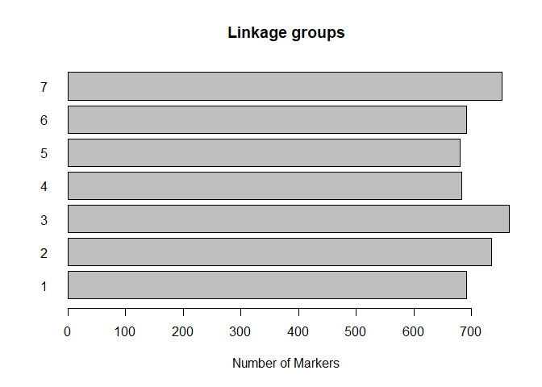

<!-- README.md is generated from README.Rmd. Please edit that file -->
brapix
======

The goal of brapix is to provide eXtra tools for convenient bulk download breeding data and also do quick summaries and quality checks.

Installation
------------

You can install brapix from github with:

``` r
# install.packages("devtools")

devtools::install_github("c5sire/brapix")
```

Example
-------

This is a basic example which shows you how to solve a common problem:

``` r
library(brapi)
#> This is the development version of the 'brapi' package!
#> You are using version  0.9.9036 
#> 
#>  Please register any issues at: https://github.com/CIP-RIU/brapi/issues
library(brapix)
library(magrittr)


con <- ba_db()$germinate_test

loc <- ba_locations(con, pageSize = 10000)
#> URL call was: https://ics.hutton.ac.uk/germinate-demo/cactuar/brapi/v1/locations?page=0&pageSize=10000
#> Server status:  ok!
#> Returning page 0 (max. 0) with max. 10000 items (out of a total of 508).

ba_describe(loc)
#> n locations = 508
#> n locations with missing lat/lon = 0 (0%)

gmp <- ba_genomemaps(con = con)
#> URL call was: https://ics.hutton.ac.uk/germinate-demo/cactuar/brapi/v1/maps/?page=0&pageSize=30&species=&type=&
#> Server status:  ok!
#> Returning page 0 (max. 0) with max. 30 items (out of a total of 1).

gmp
#> # A tibble: 1 x 4
#>   mapDbId name        markerCount linkageGroupCount
#> * <chr>   <chr>             <int>             <int>
#> 1 1       All markers        4985                 7

ba_genomemaps_details(con, mapDbId = "1") %>% ba_chart()
#> URL call was: https://ics.hutton.ac.uk/germinate-demo/cactuar/brapi/v1/maps/1/
#> Server status:  ok!
#> Returning page 0 (max. 0) with max. 1 items (out of a total of 1).
```


